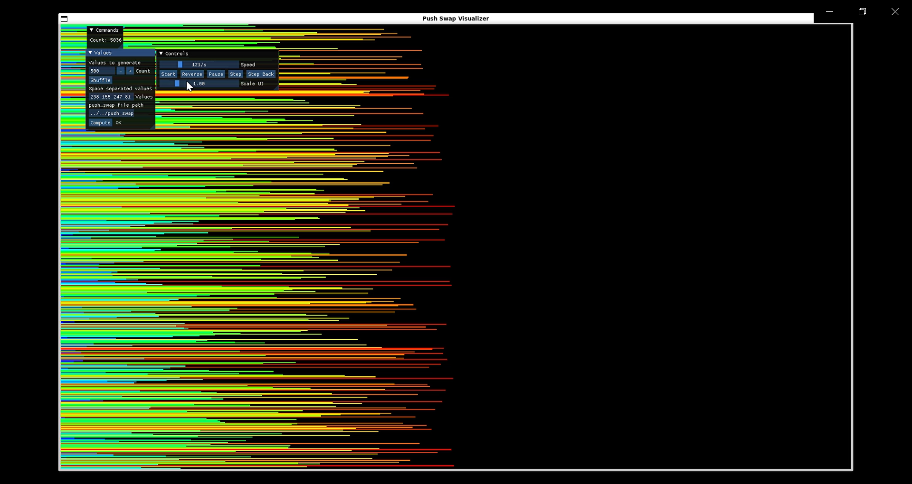

# PUSH_SWAP
## 🎥 Visual

https://yetsa1.github.io/PUSH_SWAP/

## 🧠 Description

This project simulates an **optimization problem under constraints**, where I designed a custom algorithm in C to **sort data using the smallest number of operations possible**.

It helped me understand the impact of algorithmic efficiency in real-world scenarios such as:

- Logistics  
- Process automation  
- Large-scale data handling  

---

## ⚙️ How does it work?

The `push_swap` program receives a list of unsorted integers as arguments and must print to standard output the smallest possible list of instructions to sort those numbers using **two stacks (`a` and `b`)** and a limited set of operations:

- `sa`, `sb`, `ss` – swaps  
- `pa`, `pb` – pushes  
- `ra`, `rb`, `rr` – rotates  
- `rra`, `rrb`, `rrr` – reverse rotates  

---

## 🚀 Implemented algorithms

| Input size        | Algorithm                                |
|-------------------|------------------------------------------|
| 2 elements        | Direct swap                              |
| 3 elements        | Minimal case handling (`sort_3`)         |
| 4–10 elements     | Minimum value extraction strategy        |
| >10 elements      | Chunk-based algorithm (`ksort`) with indexed stack values |

---

## 🧪 Testing

The project has been tested with:

- 42's Deepthought  
- `checker_linux` to verify sorted stacks  
- Custom shell testers  
- `push_swap_visualizer` to visually track each operation  

---

## 🖥️ Visualizer (graphical test)

To visualize the sorting process step by step, you can use this graphical tester made by another 42 student:

🔗 https://github.com/o-reo/push_swap_visualizer

-----SPANISH-----

## 🧠 Descripción

Este proyecto simula un **problema de optimización bajo restricciones**, donde diseñé un algoritmo personalizado en C para **ordenar datos con el menor número de operaciones posible**.

Me ayudó a comprender el impacto de la eficiencia algorítmica en escenarios reales como:

- Logística
- Automatización de procesos
- Manejo de grandes volúmenes de datos

---

## ⚙️ ¿Cómo funciona?

El programa `push_swap` recibe como argumentos una lista de enteros desordenados y debe imprimir en salida estándar una lista de instrucciones que ordenen esos números usando **dos stacks (`a` y `b`)** y un conjunto limitado de operaciones:

- `sa`, `sb`, `ss` – swaps
- `pa`, `pb` – pushes
- `ra`, `rb`, `rr` – rotates
- `rra`, `rrb`, `rrr` – reverse rotates

---

## 🚀 Algoritmos implementados

| Tamaño del input | Algoritmo           |
|------------------|---------------------|
| 2 elementos      | Swap directo        |
| 3 elementos      | Algoritmo mínimo (`sort_3`) |
| 4–10 elementos   | Extracción de mínimos |
| >10 elementos    | Algoritmo por chunks (`ksort`) con indexación optimizada |

---

## 🧪 Pruebas

El proyecto ha sido probado con:
- Deepthought de 42
- `checker_linux` para verificar que los stacks quedan ordenados
- Testers personalizados
- `push_swap_visualizer` para ver el proceso gráficamente

---

## 🖥️ Visualizador (test gráfico)

Para ver cómo se ordenan los números paso a paso, puedes usar este visualizador gráfico hecho por otro estudiante:

🔗 https://github.com/o-reo/push_swap_visualizer

---
